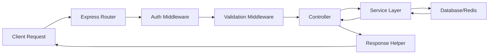
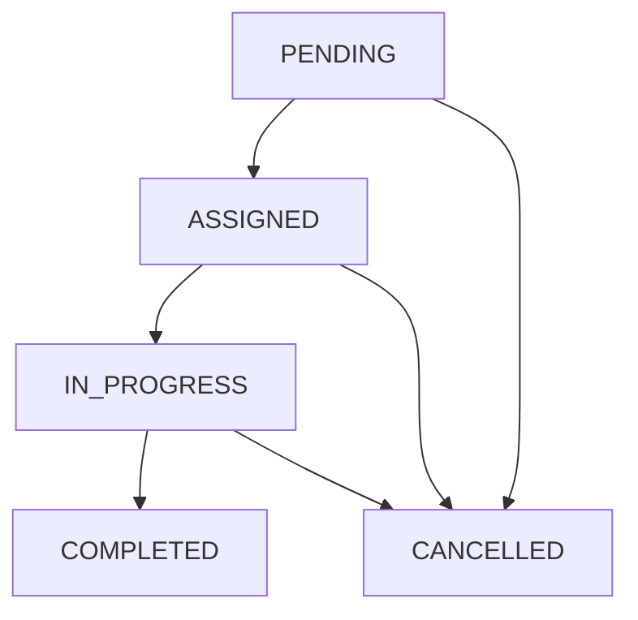

# 🏠 Home Services Marketplace API

<div align="center">


*A comprehensive marketplace platform connecting customers with home service providers*

[🚀 Quick Start](#-quick-start) • [📚 API Documentation](#-api-documentation) • [🔧 Configuration](#-configuration) • [🏗️ Architecture](#️-architecture)

</div>

---

## 📋 Table of Contents

- [✨ Features](#-features)
- [🚀 Quick Start](#-quick-start)
- [🔧 Configuration](#-configuration)
- [📚 API Documentation](#-api-documentation)
- [🏗️ Architecture](#️-architecture)
- [🔐 Authentication](#-authentication)
- [👥 User Roles](#-user-roles)
- [📊 Database Schema](#-database-schema)
- [🛠️ Development](#️-development)
- [🚀 Deployment](#-deployment)
- [🧪 Testing](#-testing)
- [📈 Monitoring](#-monitoring)

---

## ✨ Features

<table>
<tr>
<td width="50%">

### 🎯 **Core Features**
- ✅ Multi-role authentication system
- ✅ Service booking & management
- ✅ Real-time booking status tracking
- ✅ Email notifications with OTP
- ✅ Advanced search & filtering
- ✅ Comprehensive admin panel

</td>
<td width="50%">

### 🔧 **Technical Features**
- ✅ RESTful API architecture
- ✅ JWT-based authentication
- ✅ Redis caching & session management
- ✅ Database migrations & seeders
- ✅ Input validation & sanitization
- ✅ Comprehensive error handling

</td>
</tr>
</table>

---

## 🚀 Quick Start

### Prerequisites

```bash
# Required software
Node.js >= 18.0.0
PostgreSQL >= 12.0
Redis >= 6.0
npm or yarn
```

### Installation

```bash
# 1. Clone the repository
git clone <repository-url>
cd "Home Services Marketplace/apps/server"

# 2. Install dependencies
npm install

# 3. Environment setup
cp .env.example .env
# Edit .env with your configuration

# 4. Database setup
npx sequelize-cli db:create
npx sequelize-cli db:migrate
npx sequelize-cli db:seed:all

# 5. Start the server
npm start
```

### 🎉 Server Running!
```
✅ Server: http://localhost:8000
✅ Health Check: http://localhost:8000/health-check
✅ API Base: http://localhost:8000/api/v1
```

---

## 🔧 Configuration

### Environment Variables

<details>
<summary>📝 <strong>Click to expand configuration details</strong></summary>

```env
# Server Configuration
NODE_ENV=development
PORT=8000

# Database Configuration
DB_USERNAME=postgres
DB_PASSWORD=your_password
DB_HOST=localhost
DB_NAME=HomeServicesMarketplaceDB
DB_DIALECT=postgres

# Email Configuration (SMTP)
SMTP_USER=your_email@gmail.com
SMTP_PASS=your_app_password
EMAIL_FROM=noreply@homeservices.com

# JWT Configuration
JWT_SECRET=your_super_secret_key_here
JWT_EXPIRES_IN=7d

# Admin Configuration
SUPERADMIN_EMAIL=admin@homeservices.com
SUPERADMIN_PASSWORD=SecurePassword123!
SUPERADMIN_NAME=Super Admin
```

</details>

---

## 📚 API Documentation

### 🔗 Base URL: `http://localhost:8000/api/v1`

<details>
<summary>👤 <strong>User Management APIs</strong></summary>

#### Authentication
```http
POST /users/register
POST /users/register/verify-otp
POST /users/login
GET  /users/verified-users
```

**Example: User Registration**
```json
POST /api/v1/users/register
{
  "name": "John Doe",
  "email": "john@example.com",
  "password": "SecurePass123!"
}
```

</details>

<details>
<summary>🏢 <strong>Service Provider APIs</strong></summary>

#### Provider Management
```http
POST /providers/register
POST /providers/login
GET  /providers/verified-providers
```

**Example: Provider Registration**
```json
POST /api/v1/providers/register
{
  "name": "ABC Services",
  "email": "provider@abc.com",
  "password": "ProviderPass123!"
}
```

</details>

<details>
<summary>🛠️ <strong>Service Management APIs</strong></summary>

#### Service Operations
```http
POST   /services/add
DELETE /services/delete/:id
GET    /services/listing
GET    /services/types
```

**Example: Add Service**
```json
POST /api/v1/services/add
{
  "name": "Deep House Cleaning",
  "type": "CLEANING",
  "price": 299.99,
  "description": "Complete house cleaning service"
}
```

</details>

<details>
<summary>📅 <strong>Booking Management APIs</strong></summary>

#### Booking Operations
```http
POST /bookings/create
GET  /bookings/:id
GET  /bookings/listing
GET  /bookings/pending
POST /bookings/assign-provider
POST /bookings/update-to-progress
POST /bookings/update-to-completed
POST /bookings/cancel
POST /bookings/reject
```

**Example: Create Booking**
```json
POST /api/v1/bookings/create
{
  "customer_id": 1,
  "service_id": 5,
  "scheduled_date": "2024-02-15T10:00:00Z",
  "price": 299.99
}
```

</details>

<details>
<summary>👑 <strong>Admin Management APIs</strong></summary>

#### Admin Operations
```http
GET    /admin/bookings              # Advanced booking listing
GET    /admin/bookings/stats        # Dashboard statistics
GET    /admin/bookings/:id/logs     # Audit trail
PUT    /admin/bookings/:id/status   # Force status update
POST   /admin/bookings/assign-provider
PUT    /admin/bookings/:id/cancel   # Admin cancel
DELETE /admin/bookings/:id          # Hard delete
PUT    /admin/bookings/bulk-update  # Bulk operations
```

**Example: Admin Booking Stats**
```json
GET /api/v1/admin/bookings/stats?date_from=2024-01-01&date_to=2024-12-31

Response:
{
  "code": 1,
  "message": "Booking statistics fetched successfully",
  "data": {
    "pending": 15,
    "assigned": 8,
    "in_progress": 5,
    "completed": 120,
    "cancelled": 12,
    "total": 160,
    "revenue": 15000.00
  }
}
```

</details>

---

## 🏗️ Architecture

### 📁 Project Structure

```
src/
├── 📁 constants/          # Application constants
│   ├── bookingStatus.constant.js
│   ├── serviceType.constant.js
│   └── public.constant.js
├── 📁 controllers/        # Request handlers
│   ├── user.controller.js
│   ├── booking.controller.js
│   ├── service.controller.js
│   ├── provider.controller.js
│   └── admin.controller.js
├── 📁 db/                 # Database layer
│   ├── 📁 models/         # Sequelize models
│   ├── 📁 migrations/     # Database migrations
│   └── 📁 seeders/        # Initial data
├── 📁 middlewares/        # Express middlewares
│   ├── auth.middleware.js
│   ├── validation.middleware.js
│   └── error.middleware.js
├── 📁 routers/            # Route definitions
├── 📁 services/           # Business logic
├── 📁 helpers/            # Utility functions
└── 📁 utils/              # Common utilities
```

### 🔄 Request Flow



---

## 🔐 Authentication

### JWT Token Structure
```json
{
  "id": 123,
  "email": "user@example.com",
  "role": "USER",
  "iat": 1640995200,
  "exp": 1641600000
}
```

### Authentication Flow
1. **Registration** → Email OTP verification → Account activation
2. **Login** → JWT token generation → Token-based access
3. **Protected Routes** → Token validation → Role-based authorization

---

## 👥 User Roles

<table>
<tr>
<th>Role</th>
<th>Permissions</th>
<th>Access Level</th>
</tr>
<tr>
<td>🔴 <strong>SUPER ADMIN</strong></td>
<td>Full system access, user management, system configuration</td>
<td>Complete Control</td>
</tr>
<tr>
<td>🟠 <strong>ADMIN</strong></td>
<td>Booking management, service oversight, user support</td>
<td>Administrative</td>
</tr>
<tr>
<td>🟡 <strong>SERVICE PROVIDER</strong></td>
<td>Accept/reject bookings, update status, manage profile</td>
<td>Provider Operations</td>
</tr>
<tr>
<td>🟢 <strong>USER</strong></td>
<td>Create bookings, view history, cancel bookings</td>
<td>Customer Access</td>
</tr>
</table>

---

## 📊 Database Schema

### Core Entities

<details>
<summary>📋 <strong>Database Tables Overview</strong></summary>

#### Users Table
```sql
- id (Primary Key)
- name (String)
- email (Unique)
- password (Hashed)
- role_id (Foreign Key)
- isActive (Boolean)
- timestamps
```

#### Bookings Table
```sql
- id (Primary Key)
- customer_id (Foreign Key → Users)
- provider_id (Foreign Key → Users)
- service_id (Foreign Key → Services)
- scheduled_date (DateTime)
- status (Enum: PENDING, ASSIGNED, IN_PROGRESS, COMPLETED, CANCELLED)
- price (Decimal)
- reason (String)
- timestamps
```

#### Services Table
```sql
- id (Primary Key)
- name (String)
- slug (Unique)
- type (Enum: CLEANING, PLUMBING, ELECTRICAL, etc.)
- price (Decimal)
- description (Text)
- status (Boolean)
- timestamps
```

</details>

### 🔄 Booking Status Flow



---

## 🛠️ Development

### Available Scripts

```bash
# Development
npm run dev          # Start with nodemon
npm start           # Production start
npm test            # Run tests

# Database
npx sequelize-cli db:migrate        # Run migrations
npx sequelize-cli db:seed:all       # Seed database
npx sequelize-cli db:migrate:undo   # Rollback migration
```

### Code Quality

```bash
# Linting (if configured)
npm run lint
npm run lint:fix

# Formatting (if configured)
npm run format
```

---

## 🚀 Deployment

### Production Checklist

- [ ] Environment variables configured
- [ ] Database migrations applied
- [ ] Redis server running
- [ ] SSL certificates installed
- [ ] Monitoring tools configured
- [ ] Backup strategy implemented

### Docker Deployment (Optional)

```dockerfile
FROM node:18-alpine
WORKDIR /app
COPY package*.json ./
RUN npm ci --only=production
COPY . .
EXPOSE 8000
CMD ["npm", "start"]
```

---

## 🧪 Testing

### Test Categories

```bash
# Unit Tests
npm run test:unit

# Integration Tests
npm run test:integration

# API Tests
npm run test:api

# Coverage Report
npm run test:coverage
```

---

## 📈 Monitoring

### Health Checks

```http
GET /health-check
Response: "server is up and running"
```

### Logging

- **Error Logging**: Console-based error tracking
- **Request Logging**: HTTP request/response logging
- **Database Logging**: Query performance monitoring

---

## 🤝 Contributing

1. Fork the repository
2. Create feature branch (`git checkout -b feature/amazing-feature`)
3. Commit changes (`git commit -m 'Add amazing feature'`)
4. Push to branch (`git push origin feature/amazing-feature`)
5. Open Pull Request

---

## 📞 Support

<div align="center">

**Need Help?**

📧 Email: priyanshurazz4@gmail.com 
📱 Phone: +91 9872607996 
💬 Chat: Available 24/7  

</div>

---

## 📄 License

This project is licensed under the ISC License - see the [LICENSE](LICENSE) file for details.

---

<div align="center">

**Made with ❤️ by the Owner of Home Services Marketplace(Priyanshu)**

⭐ Star this repo if you find it helpful!

</div>